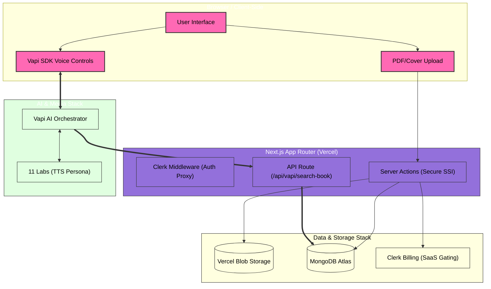
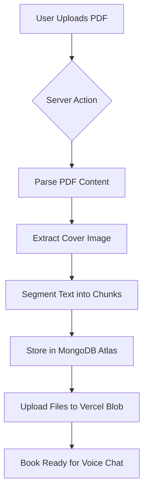
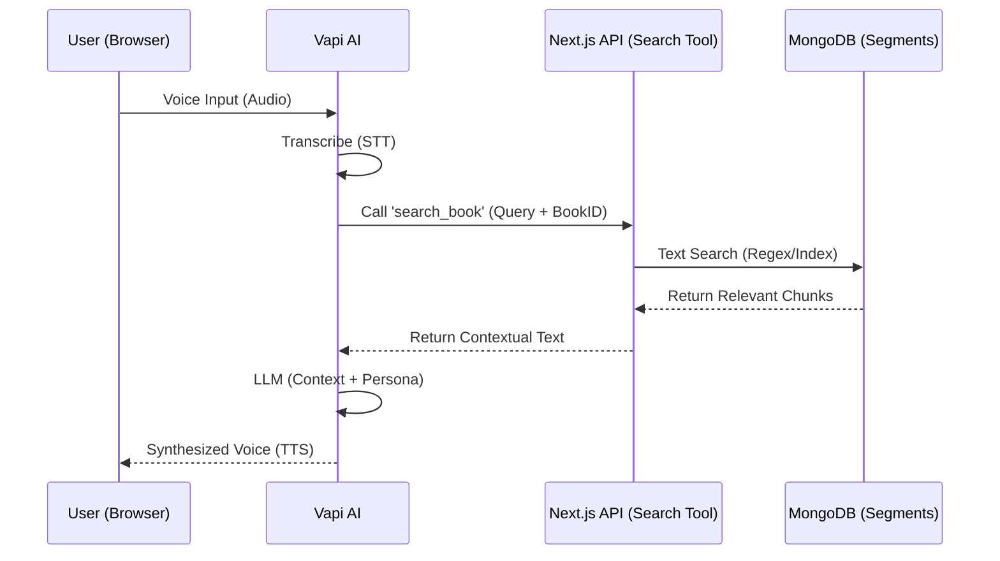

# 📖 PageWhisper 

<div align="center">


[](https://opensource.org/licenses/MIT)
[](https://page-whisper.vercel.app)
[](http://makeapullrequest.com)

**Transform static PDFs into interactive, voice-synthesized personas.**
</div>

---

**PageWhisper** is a high-performance AI SaaS that leverages a cutting-edge **RAG (Retrieval-Augmented Generation)** pipeline to allow users to have real-time, human-like conversations with their books.

[**Live Demo**](https://page-whisper.vercel.app) 

---

## 📍 Table of Contents

* [🚀 Key Features](#-key-features)
* [🏗️ Project Architecture](#️-project-architecture)
  * [🧩 System Components](#-system-components)
  * [🔄 System Architecture Diagram](#-system-architecture-diagram)
  * [⚙️ Architecture Highlights](#️-architecture-highlights)
* [🔄 Workflow Diagram](#-workflow-diagram-1)
* [📊 Data Flow Diagram (RAG & Voice)](#-data-flow-diagram-rag--voice)
* [💻 Tech Stack](#-tech-stack)
  * [🛠️ Technical Breakdown](#️-technical-breakdown)
* [🛠️ Installation & Setup](#️-installation--setup)
  * [🚀 Getting Started](#-getting-started)
* [🔑 Environment Variables](#-environment-variables)
* [⚙️ Configuration Details](#️-configuration-details)
* [🔐 Security & Optimization](#-security--optimization)
* [📈 Live Dashboard & SaaS Metrics](#-live-dashboard--saas-metrics)

---

## 🚀 Key Features

* **🎙️ Real-time Voice Conversations:** Powered by **Vapi** and **11 Labs** for ultra-low latency, human-like dialogue.
* **📂 Intelligent PDF RAG:** Custom pipeline that segments PDFs into 500-word chunks for highly accurate context retrieval.
* **💳 Tiered SaaS Subscriptions:** Managed via **Clerk Billing** (Free, Standard, and Pro tiers).
* **🖼️ Automated Metadata:** Auto-generates book covers from the first page of uploaded PDFs via `pdfjs-dist`.
* **🔍 Global Search:** Optimized case-insensitive search across title and author using MongoDB Text Indices.
* **📱 Cinematic UI:** "Dark Mode" and "Beige Literary" aesthetics built with Tailwind CSS and Shadcn UI.

---

## 🏗️ Project Architecture

PageWhisper is built on a **Decoupled Client-Server Architecture** optimized for edge performance, security, and real-time audio streaming.

<div align="center">
  <h3>Core Tech Stack Overview</h3>
  
  
  
  
  <br>
  
  
  
</div>

---

### 🧩 System Components

1* **Frontend (Next.js 15+ App Router):** React Server Components (RSC) manage SEO and initial data fetching. Client Components handle the interactive Voice UI and audio streaming.

2* **Voice Orchestration (Vapi AI):** A managed service that handles the complexity of WebRTC audio streams, transcription (STT), and turn-taking logic.

3* **Database (MongoDB Atlas):** An indexed document store containing book metadata and, crucially, the segmented text chunks for RAG.

4* **Object Store (Vercel Blob):** Edge-optimized storage for raw PDF binaries and the automatically extracted cover images.

5* **Identity & Billing (Clerk):** Unified session management (JWT) and SaaS subscription enforcement (Free vs. Pro).

---

### 🔄 System Architecture Diagram

This high-level diagram visualizes how data flows between the user, your Next.js application, and the crucial third-party AI/Data services.



---

## 🔄 Workflow Diagram

This diagram illustrates the lifecycle of a book from upload to conversation readiness.


---

## 📊 Data Flow Diagram (RAG & Voice)
When a user speaks, the system performs a "Tool Call" to fetch relevant book segments before responding.



---
## 💻 Tech Stack

### Frontend & Core


### AI & Voice Orchestration


### Backend & Infrastructure


---

### 🛠️ Technical Breakdown

| Layer | Technology | Usage |
| :--- | :--- | :--- |
| **Framework** | **Next.js 15+** | App Router, Server Actions, and Turbopack for lightning-fast builds. |
| **Language** | **TypeScript** | Strict type safety across the RAG pipeline and API responses. |
| **Voice Engine** | **Vapi AI** | WebRTC orchestration for ultra-low latency (<500ms) voice loops. |
| **Speech Synth** | **11 Labs** | Flash 2.5 model for high-fidelity, emotional human personas. |
| **Database** | **MongoDB Atlas** | Storing document metadata and indexed text segments for context retrieval. |
| **Object Store** | **Vercel Blob** | Edge-optimized storage for PDF binaries and generated assets. |
| **Authentication** | **Clerk** | Secure OIDC identity management and JWT session handling. |
| **SaaS Billing** | **Clerk Billing** | Tiered subscription enforcement (Free, Standard, Pro). |
| **PDF Engine** | **PDF.js** | Client-side parsing and cover image extraction from raw buffers. |

---

### ⚙️ Architecture Highlights
* **Hybrid Rendering:** Uses **React Server Components (RSC)** for library fetching and **Client Components** for the real-time audio visualizer.
* **Smart Throttling:** Next.js **Middleware** manages rate-limiting and session validation to prevent API abuse.
* **Indexed Search:** Implements MongoDB **Text and Sparse Indices** to ensure book context is retrieved in sub-100ms for the AI.

---
## 🛠️ Installation & Setup

Follow these steps to get a local copy of **PageWhisper** up and running.

### 📋 Prerequisites

* **Node.js 20+** (Recommended: Node 24 for the latest Turbopack features)
* **npm** or **pnpm**
* **Vercel CLI** (`npm i -g vercel`)
* Accounts for: [Clerk](https://clerk.com/), [MongoDB Atlas](https://www.mongodb.com/atlas), [Vercel](https://vercel.com/), and [Vapi AI](https://vapi.ai/).

### 🚀 Getting Started

1. **Clone the Repository:**
```bash
   git clone [https://github.com/salonyranjan/page-whisper.git](https://github.com/salonyranjan/page-whisper.git)
   cd page-whisper
```
  
   
 2. **Install Dependencies:**
```bash
npm install
```

 
3. **Authenticate & Link Vercel:**
This project uses Vercel Blob and Environment Variables managed by Vercel.
```bash
vercel login
vercel link
```

 
4. **Sync Environment Variables:**
Pull the production variables into your local .env.local file:
```bash
vercel env pull .env.local
```

 
5.  **Initialize Development Server:**
```bash
npm run dev
```
 
Your app should now be running at http://localhost:3000.

---
## 🔑 Environment Variables

To run this project, you will need to add the following variables to your `.env.local` file. 

> **Note:** For local development, it is highly recommended to use the [Vercel CLI](https://vercel.com/docs/cli) command `vercel env pull .env.local` to sync these securely from your dashboard.

### `.env.local` Template
```env
# Clerk Authentication
NEXT_PUBLIC_CLERK_PUBLISHABLE_KEY=pk_test_...
CLERK_SECRET_KEY=sk_test_...
NEXT_PUBLIC_CLERK_SIGN_IN_URL=/sign-in
NEXT_PUBLIC_CLERK_SIGN_UP_URL=/sign-up

# Database
MONGODB_URI=mongodb+srv://...

# Vercel Storage (Blob)
BLOB_READ_WRITE_TOKEN=vercel_blob_rw_...

# Vapi AI (Voice)
NEXT_PUBLIC_VAPI_API_KEY=...
NEXT_PUBLIC_ASSISTANT_ID=...
```
---

## ⚙️ Configuration Details

This project integrates several industry-leading APIs. Below are the specific configuration requirements for each service to ensure the **RAG** and **Voice** pipelines function correctly.

### 🎙️ Vapi AI Configuration
To enable the voice assistant, your Vapi Assistant must be configured with a specific **Tool Call**:

1.  **Assistant System Prompt:** Use a prompt that instructs the AI to "act as the book" and use the `search_book` tool for context.
2.  **Custom Tool:** Create a tool named `search_book` in the Vapi Dashboard:
    * **Method:** `POST`
    * **URL:** `https://your-deployment.vercel.app/api/vapi/search-book`
    * **Parameters:**
        * `query` (string): The search terms.
        * `bookId` (string): The ID of the book to search within.

### 🔐 Clerk Authentication & Billing
Configure your Clerk dashboard to handle the SaaS lifecycle:

* **Middleware:** Ensure `proxy.ts` (or `middleware.ts`) is active to inject auth headers into API routes.
* **Redirects:** Set the following paths in the Clerk Dashboard:
    * **Sign-In:** `/sign-in`
    * **Sign-Up:** `/sign-up`
    * **After Sign-In:** `/`
* **Billing (Pro Tier):** Enable **Clerk Billing** and create three plans: `free`, `standard`, and `pro`. The app enforces limits based on these exact slugs.

### 🍃 MongoDB Indexing
For high-performance Retrieval-Augmented Generation (RAG), you must run the following command in your MongoDB Atlas shell to enable text searching:

```javascript
db.booksegments.createIndex({ content: "text", bookId: 1 })
```
<p align="right">(<a href="#-pagewhisper">back to top</a>)</p>

## 🔐 Security & Optimization

### 🛡️ Security Architecture
Security is not an afterthought in PageWhisper. We implement a **Zero-Trust Backend** philosophy:

* **Server-Side Identity (SSI):** Unlike standard implementations, PageWhisper resolves user identity via Clerk's `auth()` within **Next.js Server Actions**. This prevents "ID Spoofing," where a malicious user could attempt to write data to another user's library by modifying client-side payloads.
* **JWT Handshake Validation:** Every Vapi voice session is initialized with a short-lived OIDC token. The background "Tool Calls" between Vapi and our API are secured via shared secrets and session-bound validation.
* **Clock Skew Mitigation:** Custom middleware logic accounts for system clock discrepancies between the client and Clerk's global servers, preventing the "JWT not active yet" loop in high-latency environments.
* **Blob Access Control:** All uploaded PDFs are stored with randomized suffixes and accessed through signed or specific public patterns, ensuring that raw file paths are not easily guessable.

### ⚡ Performance Optimization
To provide a "conversational" feel, we optimized every layer of the RAG stack:

| Optimization | Technique | Impact |
| :--- | :--- | :--- |
| **Vector-Lite Search** | MongoDB Text & Sparse Indexing | Sub-100ms context retrieval without the overhead of a dedicated vector DB. |
| **Smart Chunking** | 500-Word Windowing | Optimizes the LLM's context window for more accurate "Persona" responses. |
| **Edge Storage** | Vercel Blob | Minimizes Time to First Byte (TTFB) for PDF parsing and cover rendering. |
| **Streaming UI** | Partial Handshake Listeners | Transcript messages are rendered via partial streams, so the UI updates as the AI thinks. |
| **Dynamic Caching** | `force-dynamic` fetching | Ensures that newly uploaded books appear instantly without stale cache issues. |

---

### 🚀 Scaling the RAG Pipeline
The application uses a custom **text-segmentation algorithm** that processes raw PDF buffers into a searchable schema. By indexing `bookId` and `content` together, the system can scale to thousands of books while maintaining near-instant response times for the Vapi voice agent.

```typescript
// Optimized MongoDB Indexing Strategy
await db.collection('booksegments').createIndex({ 
  content: "text", 
  bookId: 1 
});
```
<p align="right">(<a href="#-pagewhisper">back to top</a>)</p>

## 📈 Live Dashboard & SaaS Metrics

PageWhisper integrates real-time monitoring to track the health of the RAG pipeline and the growth of the subscription ecosystem.

### 📊 Real-Time Service Health
The application's performance is monitored across four primary dimensions:

| Metric | Monitoring Provider | Target Benchmark |
| :--- | :--- | :--- |
| **Voice Latency** | Vapi Dashboard | < 500ms (Handshake to TTS) |
| **Auth Success** | Clerk Dashboard | 99.9% Uptime |
| **Search Accuracy** | MongoDB Profiler | < 100ms Query Execution |
| **Storage I/O** | Vercel Storage | Zero-fail PDF Buffer Stream |

### 💳 SaaS Lifecycle Management
We utilize **Clerk Billing** to manage the revenue engine. The dashboard allows for real-time tracking of:

* **MRR (Monthly Recurring Revenue):** Real-time tracking of Standard ($9.99) and Pro ($19.99) conversions.
* **Subscription Churn:** Monitored via Clerk's webhook listeners to automatically revoke access when a plan is cancelled.
* **Feature Gating:** Dynamic enforcement of:
    * **Book Quotas:** 1 (Free) vs. 10 (Standard) vs. 100+ (Pro).
    * **Time Caps:** Automated session termination via backend countdown hooks when plan minutes are exhausted.
  
### 🧪 Conversation Analytics
Every interaction is logged to refine the AI's "Reading Comprehension":
* **Segment Hit Rate:** Tracking which book chunks are most frequently retrieved.
* **Tool Call Success:** Monitoring the `search_book` API endpoint to ensure the AI always has the context it needs to answer accurately.

---

### 🛠️ Maintenance & Scaling
* **Database Scaling:** MongoDB Atlas auto-scaling is enabled to handle spikes in book segment indexing.
* **Cold Starts:** Optimized via Next.js **Edge Runtime** to ensure the voice handshake is instant, even after periods of inactivity.

---

### 🤝 Contributing
Contributions are what make the open source community such an amazing place to learn, inspire, and create. Any contributions you make are **greatly appreciated**.

1. Fork the Project
2. Create your Feature Branch (`git checkout -b feature/AmazingFeature`)
3. Commit your Changes (`git commit -m 'Add some AmazingFeature'`)
4. Push to the Branch (`git push origin feature/AmazingFeature`)
5. Open a Pull Request

---

<div align="center">
  <p>Built with ❤️ by <a href="https://github.com/salonyranjan">Salony Ranjan</a></p>
  <a href="https://www.linkedin.com/in/salony-ranjan-b63200280">
    
  </a>
</div>

---
